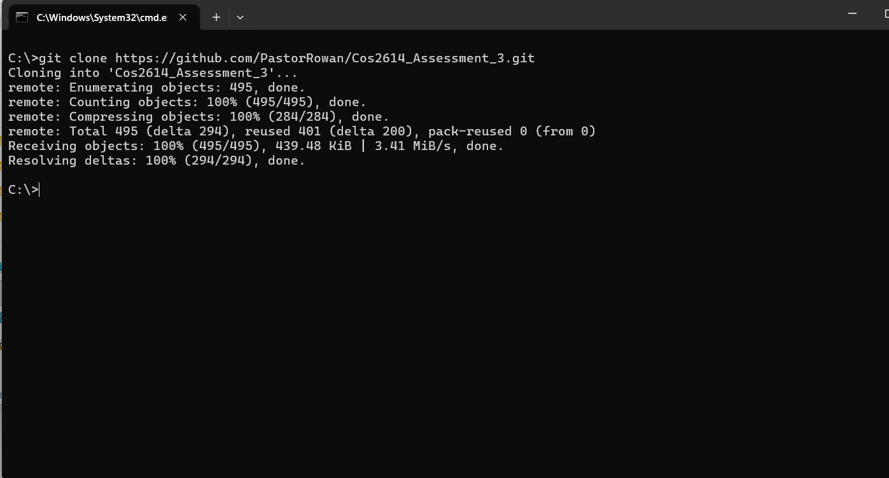
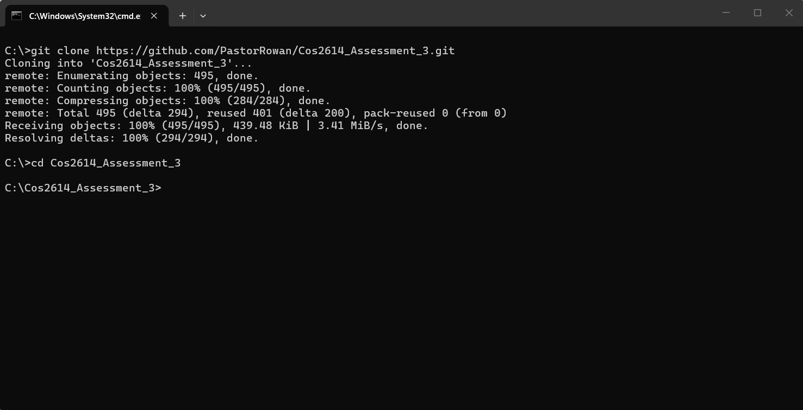
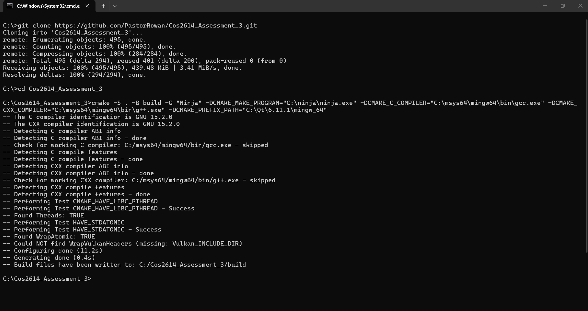
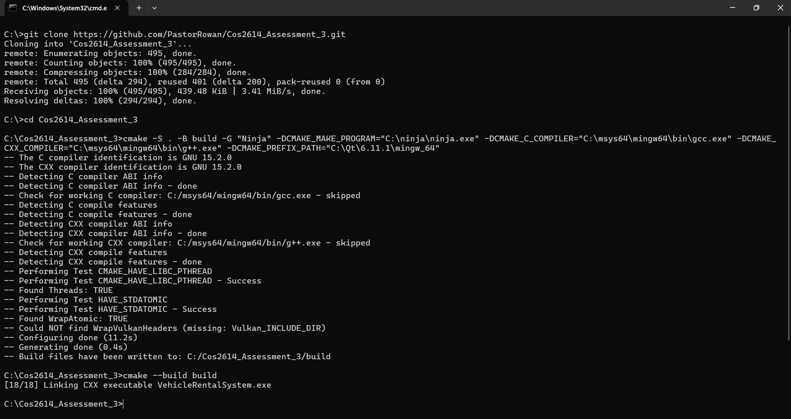
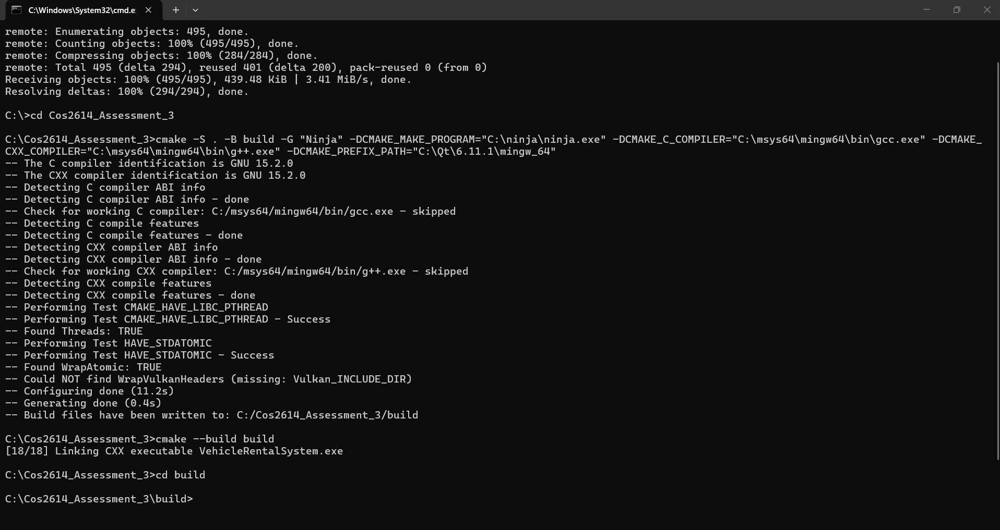
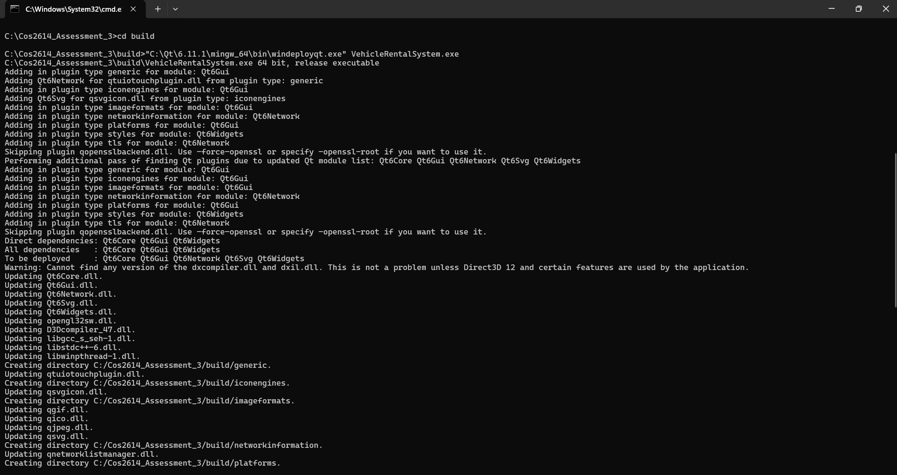
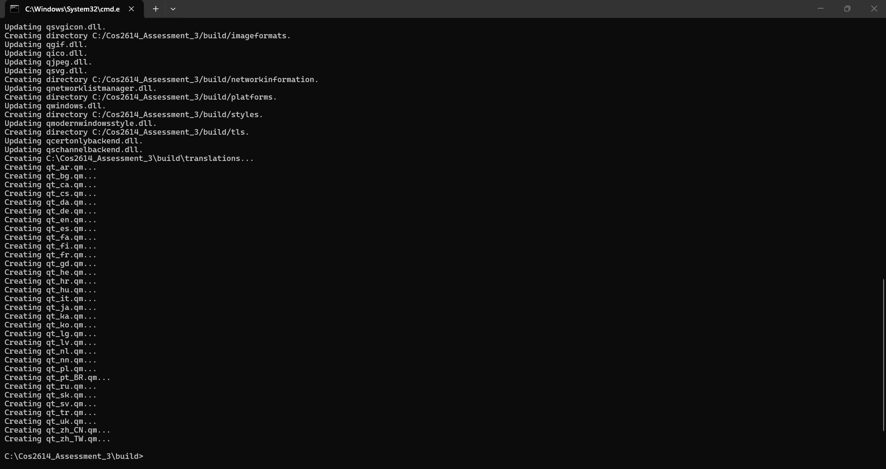
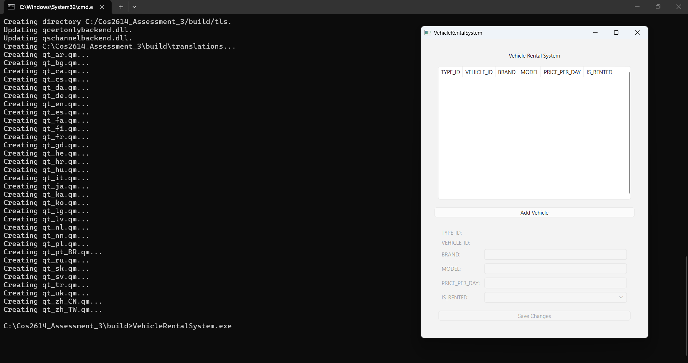

# VehicleRentalSystem

> **Important:** For the best viewing experience, it is recommended to read this `README.md` directly on the GitHub repository where all Markdown formatting, screenshots, and rendered content are displayed correctly.

https://github.com/PastorRowan/Cos2614_Assessment_3

A Qt GUI based vehicle rental management system that allows you to enter cars and motorcycles into the system with persistent state.

---

## Features

- Add vehicle (Car or Motorcycle)
- Search vehicle by ID
- Display all vehicles
- Display available vehicles only
- Rent vehicle
- Return vehicle
- Persists application state between program runs

---

## Project Structure

```
project-root/
│
├── build/                     # Build output (ignored)
├── inc/                       # Header files
├── Scripts/                   # Helper scripts (e.g., build automation)
├── src/                       # Source files
|
├── .gitignore                 # Files and folders excluded from version control
├── CMakeLists.txt             # CMake build configuration
├── CMakePresets.json          # Optional CMake configuration presets
├── Config.h.in                # Template used by CMake to generate Config.h at configure time
├── Cos2614_Assignment_3.pdf   # Assingment pdf
├── LICENSE                    # Project license
├── main.cpp                   # Application entry point
├── README.md                  # Project documentation
└── walkthrough.mp4            # Showcase how to use the app
```

---

## Getting Started

### Requirements

Ensure the following are installed:

- [ ] Qt compatible tool chain with C and C++ compiler (GCC, Clang, MSVC, etc)
- [ ] Qt 6.11.1 for specific tool chain installed
- [ ] CMake (3.16+ recommended)
- [ ] Ninja (Any build tool that CMake supports is fine)
- [ ] git is optional but recommended to make installing the project easier

### Build from Terminal using CMake:

1. Uncompress and extract all of the compressed project files into a folder called:
```
Cos2614_Assessment_3
```
Alternatively, if git is installed, run this command from the terminal:
```
git clone https://github.com/PastorRowan/Cos2614_Assessment_3.git
```


2. Traverse to the project root
```
cd Cos2614_Assessment_3
```



3. Generate build Files using this command, replace the path arguments with respect to your setup
```
cmake -S . -B build -G "Build tool name" -DCMAKE_MAKE_PROGRAM="C:\Path\to\build\tool\program.executable_binary" -DCMAKE_C_COMPILER="C:\Path\to\toolchain's\C\compiler.executable_binary" -DCMAKE_CXX_COMPILER="C:\Path\to\toolchain's\C++\compiler.executable_binary" -DCMAKE_PREFIX_PATH="C:\Path\to\Qt\6.11.1\toolChainUsed"
```

For example, with the Windows 11 operating system with the mingw64 toolchain installed the build command would be:
```
cmake -S . -B build -G "Ninja" -DCMAKE_MAKE_PROGRAM="C:\ninja\ninja.exe" -DCMAKE_C_COMPILER="C:\msys64\mingw64\bin\gcc.exe" -DCMAKE_CXX_COMPILER="C:\msys64\mingw64\bin\g++.exe" -DCMAKE_PREFIX_PATH="C:\Qt\6.11.1\mingw_64"
```

Your terminal should look similar to this this:


4. Build the Project
```
cmake --build build
```


5. Traverse to the build folder
```
cd build
```


6. If on Windows 11, fill in this command with path arguements respective to your setup, then run it to deploy the Qt application
```"C:\path\to\Qt\6.11.1\toolChainUsed\bin\windeployqt.exe" VehicleRentalSystem.exe```
(I cannot confirm whether this works on other Windows versions and how to deploy a Qt application on other operating systems)

For example, on Windows 11 with the mingw64 toolchain installed you would run
```
"C:\Qt\6.11.1\mingw_64\bin\windeployqt.exe" VehicleRentalSystem.exe
```

Your terminal should look similar to these screenshots:

Start of command


End of command


7. Run the Application
```
VehicleRentalSystem.exe
```

The application should now be running


## Application walk through video:
Please watch a video walkthrough by opening ```walkthrough.mp4``` in a compatible video player

---

## Notes
- Please watch the walkthrough video in the project root dir to see all of the functionality.
- Data is loaded on startup and saved during runtime.
- File paths are relative to the application working directory.
- File paths you use for your setup are dependant on your operating system and where the programs are located so I can only give examples.

- I have only tested the program on Windows 11 64 bit, I do not know whether the application will run on other operating systems.
